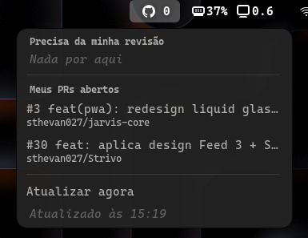

# PR Indicator

Extensão do **GNOME Shell** que mostra na barra superior os *pull requests*
esperando a sua revisão e os seus PRs próprios abertos no GitHub. Clique no
ícone pra ver a lista — clique num item da lista e ele abre no navegador.

Atualiza sozinha a cada 60 segundos.



## Requisitos

- GNOME Shell 48, 49 ou 50.
- [`gh` CLI](https://cli.github.com/) já autenticado (`gh auth login`) —
  a extensão reutiliza esse token, não pede credencial nova.

## Instalação

```bash
git clone https://github.com/sthevan027/gnome-pr-indicator.git
ln -s "$(pwd)/gnome-pr-indicator" ~/.local/share/gnome-shell/extensions/pr-indicator@sthevan027
gnome-extensions enable pr-indicator@sthevan027
```

No Wayland, o GNOME só recarrega o diretório de extensões numa sessão nova
— depois de instalar pela primeira vez, faça logout/login (ou reboot) antes
de habilitar.

## Configuração

Duas constantes no topo do `extension.js`:

| Constante | Padrão | O que faz |
|---|---|---|
| `POLL_SECONDS` | `60` | Intervalo de atualização, em segundos |
| `MAX_ITEMS_PER_SECTION` | `8` | Quantos PRs aparecem no popup por seção antes de cortar |

Depois de editar, `gnome-extensions disable` + `enable` recarrega o CSS e,
na maior parte das vezes, o JS — mas por causa de como o GNOME Shell 45+
faz cache de módulos ES, uma mudança de código nem sempre aparece sem um
logout/login.

## Estrutura

```
extension.js       lógica (cliente GitHub, indicador, popup)
metadata.json       nome, uuid, versão, versões do Shell suportadas
stylesheet.css       estilo do ícone/label na barra
icons/               ícones customizados (symbolic, recoloridos pelo tema)
```
